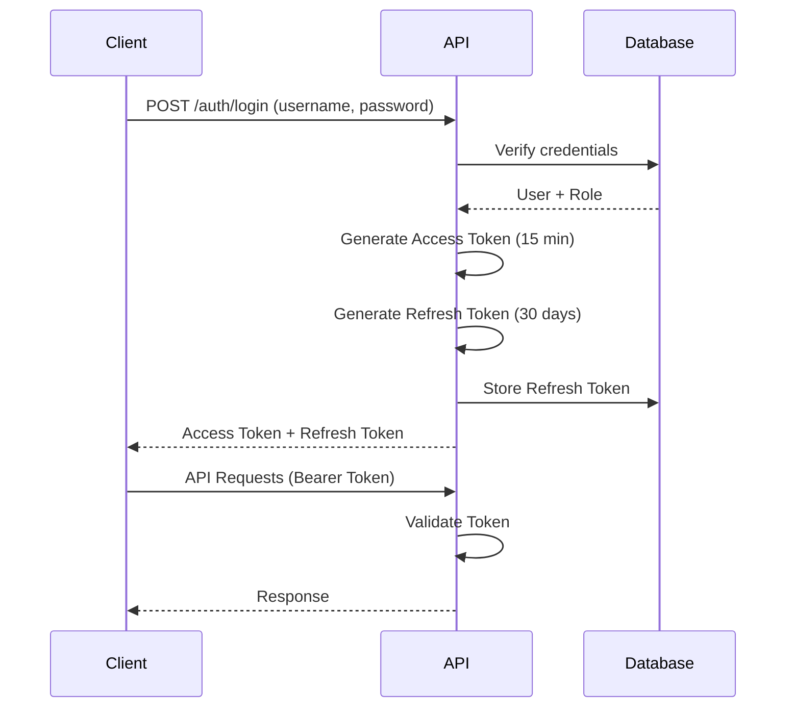

# ?? PracticeAPI - Complete Documentation Guide

> **Employee & Department Management API with JWT Authentication**  
> .NET 10 | PostgreSQL | JWT + Refresh Tokens | Role-Based Authorization | Scalar UI

---

## ?? Table of Contents

1. [Quick Start](#-quick-start)
2. [Authentication System](#-authentication-system)
3. [API Endpoints](#-api-endpoints)
4. [Authorization Rules](#-authorization-rules)
5. [Database Setup](#-database-setup)
6. [Configuration](#-configuration)
7. [Security Best Practices](#-security-best-practices)
8. [Testing Guide](#-testing-guide)
9. [Troubleshooting](#-troubleshooting)
10. [Architecture & Patterns](#-architecture--patterns)

---

## ?? Quick Start

### Prerequisites
- [ ] .NET 10 SDK installed
- [ ] PostgreSQL 12+ running
- [ ] Visual Studio 2022 or VS Code
- [ ] EF Core tools: `dotnet tool install --global dotnet-ef`

### Setup in 5 Steps

```bash
# 1. Navigate to project
cd C:\Personal\PracticeAPI\PracticeAPI

# 2. Install EF Core tools (first time only)
dotnet tool install --global dotnet-ef

# 3. Create and apply migration
dotnet ef migrations add InitialCreateWithAuth
dotnet ef database update

# 4. Run the application
dotnet run

# 5. Access API documentation
# Open: https://localhost:7xxx/scalar/v1
```

### First API Test

```bash
# Login as SuperAdmin
curl -X POST https://localhost:7xxx/api/auth/login \
  -H "Content-Type: application/json" \
  -d '{"username":"superadmin","password":"SuperAdmin@123"}'

# Expected: Access token and refresh token
```

---

## ?? Authentication System

### Overview

The API uses **JWT-based authentication** with:
- ? **Access Tokens**: Short-lived (15 min) for API access
- ? **Refresh Tokens**: Long-lived (30 days) stored in database
- ? **Token Rotation**: New tokens on every refresh
- ? **BCrypt Hashing**: Secure password storage
- ? **Role-Based Access**: 4 hierarchical roles
- ? **IP Tracking**: Audit trail for security

### Default Users (Seeded Automatically)

| Username | Password | Role | Access Level |
|----------|----------|------|--------------|
| **superadmin** | SuperAdmin@123 | SuperAdmin | Full system access |
| admin* | Admin@123 | Admin | Manage employees & departments |
| manager* | Manager@123 | Manager | Manage employees only |
| user* | User@123 | User | Read-only access |

_*Available only in Development environment_

?? **CRITICAL**: Change all default passwords immediately!

### Authentication Flow



### Token Structure

**Access Token (JWT)**:
```json
{
  "header": {
    "alg": "HS256",
    "typ": "JWT"
  },
  "payload": {
    "nameid": "1",
    "unique_name": "superadmin",
    "role": "SuperAdmin",
    "userId": "1",
    "username": "superadmin",
    "exp": 1234567890
  },
  "signature": "HMACSHA256(...)"
}
```

**Refresh Token**:
- 64-byte random cryptographic string
- Stored in database with user ID, IP, expiry
- One-time use (revoked immediately after refresh)

---

## ?? API Endpoints

### Authentication Endpoints

#### 1. **Login**
```http
POST /api/auth/login
Content-Type: application/json

{
  "username": "superadmin",
  "password": "SuperAdmin@123"
}
```

**Success Response (200)**:
```json
{
  "accessToken": "eyJhbGc...",
  "refreshToken": "abc123...",
  "expiresIn": 900,
  "username": "superadmin",
  "role": "SuperAdmin"
}
```

**Error Responses**:
- `400 Bad Request` - Invalid input
- `401 Unauthorized` - Wrong credentials or inactive user

---

#### 2. **Refresh Token**
```http
POST /api/auth/refresh
Content-Type: application/json

{
  "refreshToken": "your-refresh-token"
}
```

**Success Response (200)**:
```json
{
  "accessToken": "new-token",
  "refreshToken": "new-refresh-token",
  "expiresIn": 900
}
```

**Behavior**:
- Old refresh token is immediately revoked
- Cannot reuse the same refresh token

---

#### 3. **Logout**
```http
POST /api/auth/logout
Authorization: Bearer {access-token}
Content-Type: application/json

{
  "refreshToken": "your-refresh-token"
}
```

**Success Response (200)**:
```json
{
  "message": "Logged out successfully"
}
```

---

#### 4. **Get Current User**
```http
GET /api/auth/me
Authorization: Bearer {access-token}
```

**Success Response (200)**:
```json
{
  "userId": "1",
  "username": "superadmin",
  "role": "SuperAdmin",
  "claims": [...]
}
```

---

### Business Endpoints

#### Departments

| Method | Endpoint | Description | Auth Required |
|--------|----------|-------------|---------------|
| GET | `/api/departments` | Get all departments | Yes |
| GET | `/api/departments/{id}` | Get department by ID | Yes |
| POST | `/api/departments` | Create department | Yes (Admin+) |
| PUT | `/api/departments/{id}` | Update department | Yes (Admin+) |
| DELETE | `/api/departments/{id}` | Delete department | Yes (SuperAdmin) |

#### Employees

| Method | Endpoint | Description | Auth Required |
|--------|----------|-------------|---------------|
| GET | `/api/employees` | Get all employees | Yes |
| GET | `/api/employees/{id}` | Get employee by ID | Yes |
| GET | `/api/employees?departmentId={id}` | Filter by department | Yes |
| POST | `/api/employees` | Create employee | Yes (Manager+) |
| PUT | `/api/employees/{id}` | Update employee | Yes (Manager+) |
| DELETE | `/api/employees/{id}` | Delete employee | Yes (Admin+) |

---

## ?? Authorization Rules

### Role Hierarchy
```
SuperAdmin (Full Access)
    ?
Admin (Manage All)
    ?
Manager (Manage Employees)
    ?
User (Read Only)
```

### Departments Access Matrix

| Action | SuperAdmin | Admin | Manager | User |
|--------|------------|-------|---------|------|
| **View** | ? | ? | ? | ? |
| **Create** | ? | ? | ? | ? |
| **Update** | ? | ? | ? | ? |
| **Delete** | ? | ? | ? | ? |

### Employees Access Matrix

| Action | SuperAdmin | Admin | Manager | User |
|--------|------------|-------|---------|------|
| **View** | ? | ? | ? | ? |
| **Create** | ? | ? | ? | ? |
| **Update** | ? | ? | ? | ? |
| **Delete** | ? | ? | ? | ? |

### Implementation Examples

**Attribute-Based**:
```csharp
[Authorize(Roles = "SuperAdmin,Admin")]
[HttpPost]
public async Task<IActionResult> CreateDepartment(...)
{
    // Only SuperAdmin and Admin can execute
}
```

**Policy-Based**:
```csharp
[Authorize(Policy = "SuperAdminOnly")]
[HttpDelete("{id}")]
public async Task<IActionResult> DeleteDepartment(int id)
{
    // Only SuperAdmin can execute
}
```

---

## ??? Database Setup

### Step 1: Install EF Core Tools

```bash
dotnet tool install --global dotnet-ef

# Verify installation
dotnet ef --version
```

### Step 2: Configure Connection String

Edit `appsettings.json`:
```json
{
  "ConnectionStrings": {
    "DefaultConnection": "Host=localhost;Port=5432;Database=EmployeeManagementDB;Username=postgres;Password=postgres"
  }
}
```

### Step 3: Create Database

**Option A: Let EF Core create it** (during migration)

**Option B: Create manually**:
```bash
psql -U postgres
CREATE DATABASE "EmployeeManagementDB";
\q
```

### Step 4: Create and Apply Migration

```bash
# Navigate to project directory
cd C:\Personal\PracticeAPI\PracticeAPI

# Create migration
dotnet ef migrations add InitialCreateWithAuth

# Apply migration (creates tables and seeds data)
dotnet ef database update
```

### Expected Database Schema

**Tables Created**:
1. **Departments** - Department entities
2. **Employees** - Employee entities
3. **Roles** - Authentication roles (4 seeded)
4. **Users** - User accounts (1-4 seeded)
5. **RefreshTokens** - Active refresh tokens
6. **__EFMigrationsHistory** - Migration tracking

**Relationships**:
```
Users ????? Roles (Many-to-One)
        ??? RefreshTokens (One-to-Many)

Employees ??? Departments (Many-to-One, nullable)
```

### Verify Database Setup

```sql
-- Connect to database
psql -U postgres -d EmployeeManagementDB

-- List all tables
\dt

-- Check seeded roles
SELECT * FROM "Roles";

-- Check seeded users
SELECT "Username", "IsActive" FROM "Users";

-- Verify password hashing (length should be 60)
SELECT "Username", LENGTH("PasswordHash") FROM "Users";
```

---

## ?? Configuration

### appsettings.json

```json
{
  "ConnectionStrings": {
    "DefaultConnection": "Host=localhost;Port=5432;Database=EmployeeManagementDB;Username=postgres;Password=postgres"
  },
  "Jwt": {
    "SecretKey": "YourSuperSecretKeyThatShouldBeAtLeast32CharactersLongForHS256",
    "Issuer": "PracticeAPI",
    "Audience": "PracticeAPIClient",
    "AccessTokenExpiryMinutes": 15,
    "RefreshTokenExpiryDays": 30
  },
  "Logging": {
    "LogLevel": {
      "Default": "Information",
      "Microsoft.AspNetCore": "Warning"
    }
  }
}
```

### JWT Configuration Options

| Setting | Description | Recommendation |
|---------|-------------|----------------|
| **SecretKey** | HMAC signing key | Min 32 chars, use random generator |
| **Issuer** | Token issuer identifier | Your API name |
| **Audience** | Token audience identifier | Your client app name |
| **AccessTokenExpiryMinutes** | Access token lifetime | 15-60 minutes |
| **RefreshTokenExpiryDays** | Refresh token lifetime | 7-30 days |

### Production Settings

?? **Before deploying to production**:

```json
{
  "Jwt": {
    "SecretKey": "{{ USE_SECURE_KEY_GENERATOR }}",
    "AccessTokenExpiryMinutes": 15,
    "RefreshTokenExpiryDays": 7
  }
}
```

**Also update** `AuthenticationExtensions.cs`:
```csharp
options.RequireHttpsMetadata = true; // Change from false
```

---

## ??? Security Best Practices

### ? Implemented Security Features

1. **Password Security**
   - BCrypt hashing with automatic salt
   - No plain-text storage
   - Password validation on login

2. **Token Security**
   - Short-lived access tokens (15 min)
   - One-time refresh tokens
   - Token rotation on refresh
   - Signature verification (HMACSHA256)

3. **Access Control**
   - Role-based authorization
   - Policy-based permissions
   - Attribute-level protection

4. **Audit & Logging**
   - Failed login attempts logged
   - Token refresh tracking
   - IP address tracking for tokens
   - All auth events logged

### ?? Production Checklist

Before going live:

- [ ] **Change JWT SecretKey** to a strong random value (64+ characters)
- [ ] **Change all default passwords** (superadmin, admin, manager, user)
- [ ] **Enable HTTPS only** (`RequireHttpsMetadata = true`)
- [ ] **Implement rate limiting** on `/api/auth/login`
- [ ] **Set up account lockout** after N failed attempts
- [ ] **Configure CORS** properly (restrict allowed origins)
- [ ] **Enable logging** to external service (Serilog, Application Insights)
- [ ] **Set short token expiry** (5-15 minutes for access tokens)
- [ ] **Monitor failed logins** and unusual patterns
- [ ] **Use environment variables** for secrets (not appsettings.json)

### ?? Recommended Enhancements

**Priority 1 (Security)**:
- Rate limiting on authentication endpoints
- Account lockout policy
- Password complexity requirements
- Refresh token reuse detection
- Token blacklist (Redis)

**Priority 2 (Features)**:
- Password change endpoint
- Password reset flow (email)
- Two-Factor Authentication (2FA)
- Email verification
- User registration

**Priority 3 (Monitoring)**:
- Authentication analytics dashboard
- Failed login alerts
- Active session management
- Anomaly detection

---

## ?? Testing Guide

### Using Scalar UI (Built-in API Docs)

**Access**: `https://localhost:7xxx/scalar/v1`

#### Step 1: Login
1. Navigate to `/api/auth/login` endpoint
2. Click **"Try it out"**
3. Enter credentials:
   ```json
   {
     "username": "superadmin",
     "password": "SuperAdmin@123"
   }
   ```
4. Click **"Execute"**
5. **Copy** the `accessToken` from response

#### Step 2: Authorize
1. Click the **?? Authorize** button (top right)
2. Enter: `Bearer {your-access-token}`
3. Click **"Authorize"**
4. Click **"Close"**

#### Step 3: Test Endpoints
- All requests now include your Bearer token
- Try creating a department (should succeed as SuperAdmin)
- Try with different users to test role-based access

---

### Using cURL

```bash
# 1. Login
curl -X POST https://localhost:7xxx/api/auth/login \
  -H "Content-Type: application/json" \
  -d '{"username":"superadmin","password":"SuperAdmin@123"}'

# Save the accessToken from response

# 2. Test protected endpoint
curl -X GET https://localhost:7xxx/api/departments \
  -H "Authorization: Bearer {your-access-token}"

# 3. Test role-based access
curl -X POST https://localhost:7xxx/api/departments \
  -H "Authorization: Bearer {your-access-token}" \
  -H "Content-Type: application/json" \
  -d '{"name":"Engineering"}'

# 4. Refresh token
curl -X POST https://localhost:7xxx/api/auth/refresh \
  -H "Content-Type: application/json" \
  -d '{"refreshToken":"{your-refresh-token}"}'

# 5. Logout
curl -X POST https://localhost:7xxx/api/auth/logout \
  -H "Authorization: Bearer {your-access-token}" \
  -H "Content-Type: application/json" \
  -d '{"refreshToken":"{your-refresh-token}"}'
```

---

### Using Postman

#### Setup Environment Variables
```json
{
  "baseUrl": "https://localhost:7xxx",
  "accessToken": "",
  "refreshToken": ""
}
```

#### Auto-Save Tokens (Test Script)
In the `/api/auth/login` request, add this to **Tests** tab:
```javascript
if (pm.response.code === 200) {
    var jsonData = pm.response.json();
    pm.environment.set("accessToken", jsonData.accessToken);
    pm.environment.set("refreshToken", jsonData.refreshToken);
}
```

#### Authorization Header
In protected endpoints, set:
```
Authorization: Bearer {{accessToken}}
```

---

### Test Scenarios

#### ? Scenario 1: Happy Path
1. Login as `superadmin`
2. Receive tokens
3. Call `/api/auth/me` ? Success
4. Create department ? Success (201)
5. Create employee ? Success (201)

#### ? Scenario 2: Role-Based Access
1. Login as `user` (read-only)
2. View departments ? Success (200)
3. Try to create department ? **403 Forbidden** ?
4. Verify error message

#### ? Scenario 3: Token Refresh
1. Login and save refresh token
2. Wait 16 minutes (or test immediately)
3. Call `/api/auth/refresh`
4. Receive new token pair
5. Try using old refresh token ? **401 Unauthorized** ?

#### ? Scenario 4: Logout
1. Login and save tokens
2. Call `/api/auth/logout`
3. Try using refresh token ? **401 Unauthorized** ?

---

## ?? Troubleshooting

### Common Issues & Solutions

#### 1. "dotnet-ef does not exist"

**Error**:
```
Could not execute because the specified command or file was not found.
```

**Solution**:
```bash
dotnet tool install --global dotnet-ef
# Restart terminal/Visual Studio
dotnet ef --version
```

---

#### 2. "relation 'Roles' does not exist"

**Error**:
```
PostgresException: 42P01: relation "Roles" does not exist
```

**Solution**:
```bash
cd C:\Personal\PracticeAPI\PracticeAPI
dotnet ef migrations add InitialCreateWithAuth
dotnet ef database update
```

---

#### 3. "401 Unauthorized" on protected endpoints

**Possible Causes**:
- Token not included in request
- Token expired (15 min lifetime)
- Wrong format (must be `Bearer {token}`)
- Invalid signature (SecretKey mismatch)

**Solution**:
```bash
# Check token format
Authorization: Bearer eyJhbGc...

# Generate new token if expired
POST /api/auth/login

# Verify SecretKey in appsettings.json matches
```

---

#### 4. "403 Forbidden" even with valid token

**Cause**: User doesn't have required role

**Solution**:
- Check endpoint's `[Authorize(Roles = "...")]` attribute
- Verify user's role: `GET /api/auth/me`
- Login with appropriate user (superadmin, admin, etc.)

---

#### 5. Cannot connect to PostgreSQL

**Error**:
```
Npgsql.NpgsqlException: Connection refused
```

**Solution**:
```bash
# Windows: Check if service is running
sc query postgresql-x64-16
net start postgresql-x64-16

# Test connection manually
psql -U postgres -h localhost -p 5432

# Verify connection string in appsettings.json
```

---

#### 6. Migration already exists

**Solution**:
```bash
# Remove existing migration
dotnet ef migrations remove

# Create new one
dotnet ef migrations add InitialCreateWithAuth

# Apply it
dotnet ef database update
```

---

#### 7. Build failed during migration

**Solution**:
```bash
# Build project first to see errors
dotnet build

# Fix compilation errors, then:
dotnet ef migrations add InitialCreateWithAuth
```

---

## ??? Architecture & Patterns

### Project Structure

```
PracticeAPI/
??? Controllers/              # API endpoints
?   ??? AuthController.cs
?   ??? DepartmentsController.cs
?   ??? EmployeesController.cs
??? Services/                 # Business logic
?   ??? Interfaces/
?   ?   ??? IAuthService.cs
?   ?   ??? ITokenService.cs
?   ?   ??? IDepartmentService.cs
?   ?   ??? IEmployeeService.cs
?   ??? AuthService.cs
?   ??? TokenService.cs
?   ??? DepartmentService.cs
?   ??? EmployeeService.cs
??? Repositories/             # Data access
?   ??? Interfaces/
?   ?   ??? IRepository.cs
?   ?   ??? IDepartmentRepository.cs
?   ?   ??? IEmployeeRepository.cs
?   ??? DepartmentRepository.cs
?   ??? EmployeeRepository.cs
??? Models/                   # Domain entities
?   ??? Department.cs
?   ??? Employee.cs
?   ??? Role.cs
?   ??? User.cs
?   ??? RefreshToken.cs
??? DTOs/                     # Data transfer objects
?   ??? AuthDto.cs
?   ??? DepartmentDto.cs
?   ??? EmployeeDto.cs
??? Data/                     # Database context
?   ??? ApplicationDbContext.cs
?   ??? DatabaseSeeder.cs
??? Configuration/            # Config models
?   ??? JwtSettings.cs
??? Middleware/               # Custom middleware
?   ??? ErrorResponse.cs
?   ??? GlobalExceptionHandlerMiddleware.cs
??? Extensions/               # Extension methods
?   ??? ApplicationServiceExtensions.cs
?   ??? AuthenticationExtensions.cs
?   ??? DatabaseExtensions.cs
?   ??? MiddlewareExtensions.cs
?   ??? RepositoryExtensions.cs
?   ??? ServiceExtensions.cs
?   ??? SwaggerExtensions.cs
??? Program.cs               # Application entry point
```

### Design Patterns Used

1. **Repository Pattern**
   - Abstracts data access layer
   - Enables easy testing with mocks
   - Separates business logic from data logic

2. **Service Layer Pattern**
   - Business logic separation
   - DTOs for data transfer
   - Single responsibility principle

3. **Extension Method Pattern**
   - Clean service registration
   - Organized configuration
   - Reusable across projects

4. **Dependency Injection**
   - Loose coupling
   - Easy testing
   - Lifecycle management

5. **DTO Pattern**
   - Data encapsulation
   - API versioning support
   - Security (hide sensitive fields)

6. **Middleware Pattern**
   - Global error handling
   - Cross-cutting concerns
   - Request/response pipeline

### Clean Architecture Flow

```
HTTP Request
    ?
Controller (API Layer)
    ?
Service (Business Logic)
    ?
Repository (Data Access)
    ?
Database (PostgreSQL)
```

### Extension Methods Architecture

```csharp
// Program.cs - Clean and minimal
var builder = WebApplication.CreateBuilder(args);

// All configuration in one line!
builder.Services.AddApplicationConfiguration(builder.Configuration);

var app = builder.Build();

// Clean middleware pipeline
await app.SeedDatabaseAsync();
app.UseCustomMiddlewares();
app.UseSwaggerConfiguration(app.Environment);
app.UseAuthentication();
app.UseAuthorization();
app.MapControllers();
app.Run();
```

**Benefits**:
- ? Program.cs stays under 30 lines
- ? Configuration organized by concern
- ? Easy to test individual configurations
- ? Reusable across projects

---

## ?? Additional Resources

### NuGet Packages Used

| Package | Version | Purpose |
|---------|---------|---------|
| Microsoft.AspNetCore.OpenApi | 10.0.1 | OpenAPI support |
| Microsoft.AspNetCore.Authentication.JwtBearer | 10.0.1 | JWT authentication |
| Microsoft.EntityFrameworkCore | 10.0.1 | ORM framework |
| Microsoft.EntityFrameworkCore.Design | 10.0.1 | EF Core tools |
| Npgsql.EntityFrameworkCore.PostgreSQL | 10.0.0 | PostgreSQL provider |
| Scalar.AspNetCore | 1.2.61 | API documentation UI |
| System.IdentityModel.Tokens.Jwt | 8.2.1 | JWT token handling |
| BCrypt.Net-Next | 4.0.3 | Password hashing |

### Technology Stack

- **Framework**: .NET 10
- **Language**: C# 14.0
- **Database**: PostgreSQL 12+
- **ORM**: Entity Framework Core 10
- **Authentication**: JWT Bearer + Refresh Tokens
- **API Docs**: Scalar UI (OpenAPI 3.0)
- **Password Hashing**: BCrypt
- **Architecture**: Clean Architecture + Repository Pattern

### Official Documentation

- [ASP.NET Core](https://docs.microsoft.com/aspnet/core/)
- [Entity Framework Core](https://docs.microsoft.com/ef/core/)
- [JWT Bearer Authentication](https://docs.microsoft.com/aspnet/core/security/authentication/jwt)
- [PostgreSQL](https://www.postgresql.org/docs/)
- [BCrypt](https://github.com/BcryptNet/bcrypt.net)
- [Scalar UI](https://github.com/scalar/scalar)

### Security Resources

- [OWASP Top 10](https://owasp.org/www-project-top-ten/)
- [JWT Best Practices](https://tools.ietf.org/html/rfc8725)
- [Password Storage Cheat Sheet](https://cheatsheetseries.owasp.org/cheatsheets/Password_Storage_Cheat_Sheet.html)

---

## ?? Change Log

### v1.0 - Initial Release
- ? JWT Authentication with Refresh Tokens
- ? Role-Based Authorization (4 roles)
- ? BCrypt Password Hashing
- ? Database Seeding
- ? Extension Methods Architecture
- ? Scalar UI Documentation
- ? Global Error Handling
- ? Complete API Documentation

### Future Roadmap
- [ ] Password change endpoint
- [ ] Password reset flow
- [ ] Two-Factor Authentication (2FA)
- [ ] User registration
- [ ] Email verification
- [ ] Rate limiting
- [ ] Account lockout policy
- [ ] OAuth2/OIDC integration

---

## ?? Summary

### ? What You Have Now

**A production-ready API with**:
- ?? Secure JWT authentication
- ?? Refresh token rotation
- ?? Role-based authorization (4 roles)
- ??? PostgreSQL database
- ?? Automatic documentation (Scalar UI)
- ??? BCrypt password hashing
- ?? Database seeding
- ??? Clean architecture
- ? Extension methods pattern
- ?? Global error handling

### ?? Quick Status Check

Run this checklist to verify everything:

- [ ] PostgreSQL is running
- [ ] Database created and migrated
- [ ] 4 roles seeded (SuperAdmin, Admin, Manager, User)
- [ ] SuperAdmin user exists
- [ ] Can login and receive tokens
- [ ] Can access Scalar UI at `/scalar/v1`
- [ ] Authorization works (test different roles)
- [ ] Token refresh works
- [ ] Logout revokes tokens

### ?? Before Production

**Critical Security Steps**:
1. Change JWT SecretKey to strong random value
2. Change all default passwords
3. Enable HTTPS only (`RequireHttpsMetadata = true`)
4. Implement rate limiting
5. Set up monitoring and logging
6. Review CORS settings
7. Use environment variables for secrets

---

## ?? Support & Contributing

### Getting Help

1. **Check this documentation** - Most common issues covered
2. **Review application logs** - Check console output
3. **Verify database state** - Query tables to confirm data
4. **Test with default users** - superadmin/SuperAdmin@123

### Reporting Issues

When reporting issues, include:
- .NET version: `dotnet --version`
- PostgreSQL version: `psql --version`
- Error message (full stack trace)
- Steps to reproduce
- Expected vs actual behavior

### Contributing

This is a practice project, but improvements welcome:
- Follow existing code style
- Add tests for new features
- Update documentation
- Follow security best practices

---

**?? You're all set! Start building your API!**

**Quick Commands**:
```bash
# Setup
dotnet ef migrations add InitialCreateWithAuth
dotnet ef database update

# Run
dotnet run

# Access
# API Docs: https://localhost:7xxx/scalar/v1
# Login: POST /api/auth/login
```

**Default Login**: `superadmin` / `SuperAdmin@123`

---

_Last Updated: January 2025 | Version: 1.0 | Status: ? Production Ready_
